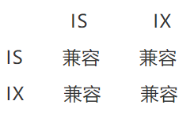
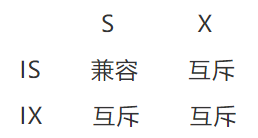

# 意向锁(Intention Locks)

表级锁，IS锁与IX锁，弱锁，仅仅表明意向；

InnoDB支持多粒度锁(multiple granularity locking)，它允许行级锁与表级锁共存，实际应用中，InnoDB使用的是意向锁。

意向锁是指，未来的某个时刻，事务可能要加共享/排它锁了，先提前声明一个意向。

意向锁有这样一些特点：

1. 首先，意向锁，是一个表级别的锁(table-level locking)；
2. 意向锁分为：
    - 意向共享锁(intention shared lock, IS)，它预示着，事务有意向对表中的某些行加共享S锁
    - 意向排它锁(intention exclusive lock, IX)，它预示着，事务有意向对表中的某些行加排它X锁
    - 举个例子：
    ```
    select ... lock in share mode，要设置IS锁；
    select ... for update，要设置IX锁；
    ```
3. 意向锁协议(intention locking protocol)并不复杂：

- 事务要获得某些行的S锁，必须先获得表的IS锁
- 事务要获得某些行的X锁，必须先获得表的IX锁

4. 由于意向锁仅仅表明意向，它其实是比较弱的锁，意向锁之间并不相互互斥，而是可以并行，其兼容互斥表如下：
   
5. 额，既然意向锁之间都相互兼容，那其意义在哪里呢？它会与共享锁/排它锁互斥，其兼容互斥表如下：
   

画外音：排它锁是很强的锁，不与其他类型的锁兼容。
这也很好理解，修改和删除某一行的时候，必须获得强锁，禁止这一行上的其他并发，以保障数据的一致性。
